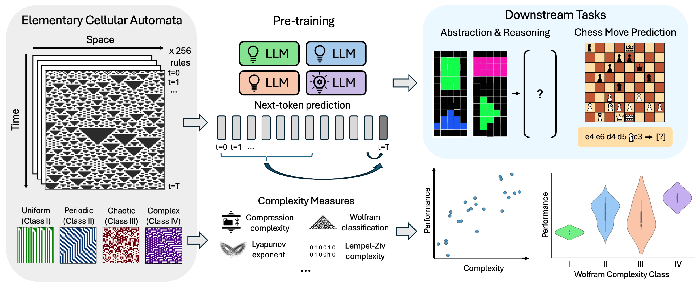

# Intelligence at the Edge of Chaos

This repository this the official repo for the paper "Intelligence at the Edge of Chaos"




## Table of Contents
1. [Overview](#overview)
2. [Setup](#setup)
3. [Pre-training](#pre-training-on-cellular-automata)
4. [Downstream Tasks](#downstream-tasks)
   - [ARC](#arc)
   - [Chess](#chess)
   - [NIM Game](#nim-game)
4. [Model Configurations](#model-configurations)
5. [Citation](#citation)
6. [License](#license)

## Overview

Explore how varying complexity levels influence model performance in both pretraining and subsequent evaluations. The implementations allow investigating whether and how increased complexity leads to better results across different tasks.

## Setup

### Create a new virtual environment:

```bash
conda create -n complexity python=3.10
conda activate complexity
```
### Install the dependencies

```bash
pip install -r requirements.txt
```

## Pre-training

**Directory:** `Pretrain/`

**Key Files:**
- `pretrain.py`: Main script for pre-training

**Run Command:**
```bash
python Pretrain/pretrain.py \
    --gpt2_size small \
    --rule 110 \
    --k 1 \
    --save_dir your_save_path \
```
See `Pretrain/pretrain.py` for more command line arguments.

## Downstream Tasks

### Abstract Reasoning Task

**Directory:** `DownStream_Task/ARC/`

**Key Files:**
- `arc.py`: The main script for the abstract reasoning downstream task
- `build_dataset.ipynb`: Prepares and processes the dataset

**Run Command:**
```bash
python DownStream_Task/ARC/arc.py \
    --gpt2_size small \
    --ckpt_dirs your_checkpoint_path \
    --save_dir your_save_path \
```
See `DownStream_Task/ARC/arc.py` for more command line arguments.

### Chess

**Directory:** `DownStream_Task/chess/`

**Key Files:**
- `chess.py`: Primary script for the chess downstream task
- `san-v2.zip`: Dataset for the chess downstream task

**Run Command:**
```bash
cd DownStream_Task/chess; unzip san-v2.zip; cd -
python DownStream_Task/chess/chess.py \
    --ckpt_dirs your_checkpoint_path \
    --save_dir your_save_path
```
See `DownStream_Task/chess/chess.py` for more command line arguments.


### NIM Game

**Directory:** `DownStream_Task/NIM/`

**Key Files:**
- `nim_game.py`: The main script for the NIM game downstream task
- `data/`: Contains the NIM game dataset

**Run Command:**
```bash
python DownStream_Task/NIM/nim_game.py \
    --ckpt_dirs your_checkpoint_path \
    --save_dir your_save_path 
```
See `DownStream_Task/NIM/nim_game.py` for more command line arguments.

## Model Configurations

The supported model sizes are:

| Model Size | Layers | Heads | Embedding Size |
|------------|--------|-------|----------------|
| tiny       | 1      | 1     | 64             |
| small      | 12     | 12    | 768            |
| large      | 36     | 20    | 1280           |

## Citation

If you find this work useful, please cite it:
```bibtex
@article{zhang2024intelligence,
  title={Intelligence at the Edge of Chaos},
  author={Zhang, Shiyang and Patel, Aakash and Rizvi, Syed A and Liu, Nianchen and He, Sizhuang and Karbasi, Amin and Zappala, Emanuele and van Dijk, David},
  journal={arXiv preprint arXiv:2410.02536},
  year={2024}
}

```
## License

This project is licensed under the GPL-3.0 License. See the LICENSE file for details.
```
